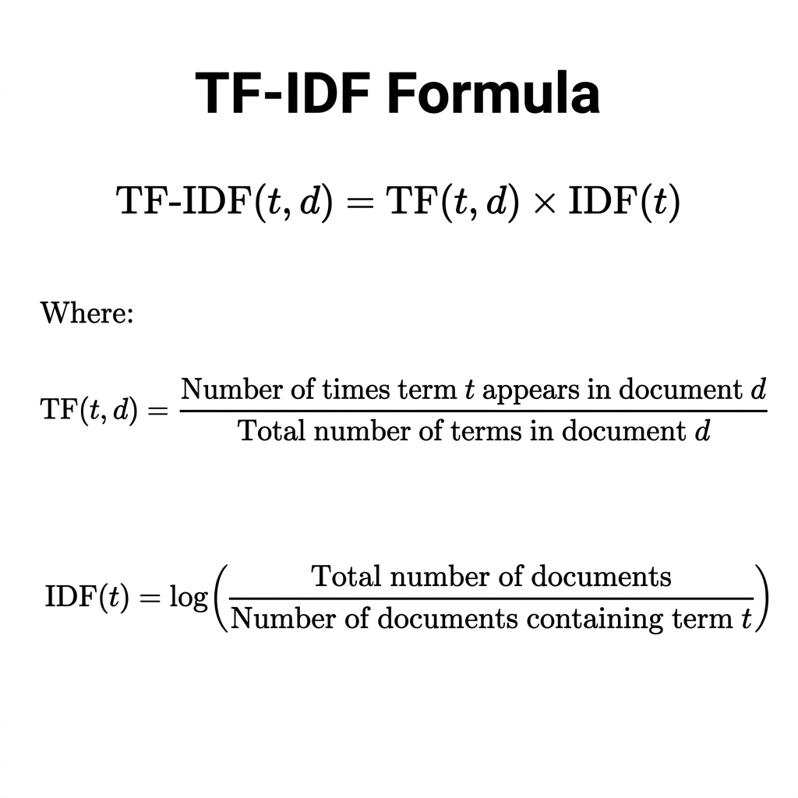
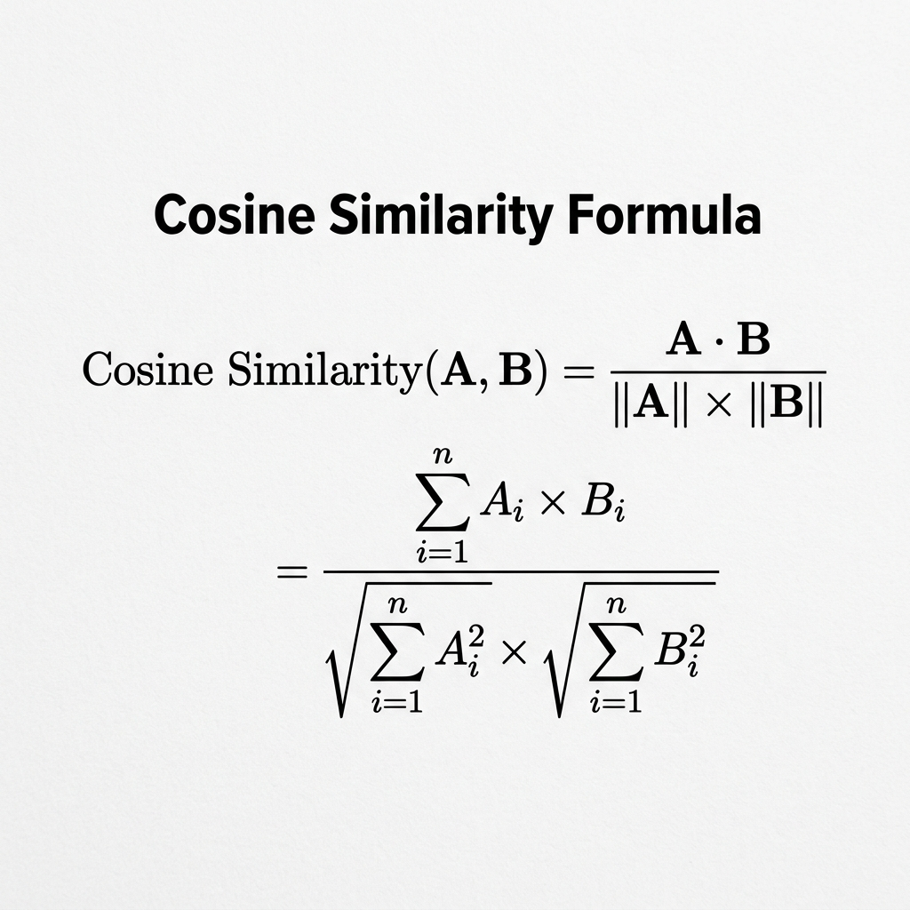

# PROJECT REPORT

## Movie/Series Recommendation System — Disney+ Hotstar Platform

**Subject:** Data Driven Recommendations

---

---

## 1. Objective

The objective of this project is to design and develop an intelligent movie and series recommendation system for the Disney+ Hotstar streaming platform. The system leverages machine learning techniques — specifically **Content-Based Filtering** using **TF-IDF (Term Frequency–Inverse Document Frequency) Vectorization** and **Cosine Similarity** — to analyze movie attributes such as genres, keywords, cast, director, and plot overview, and recommend similar content to users based on their preferences.

The project demonstrates:

- A practical application of Natural Language Processing (NLP) in recommendation systems.
- How content features can be mathematically represented and compared to generate meaningful recommendations.
- A fully functional, visually immersive web-based frontend themed around the Hotstar platform, featuring 3D graphics and interactive user experiences.

---

## 2. Introduction

### 2.1 Overview of the Problem

In the era of digital entertainment, streaming platforms such as Disney+ Hotstar, Netflix, and Amazon Prime host thousands of movies and TV series. Users often face the problem of **content overload** — with so much content available, it becomes difficult for viewers to discover movies or shows that align with their personal tastes and viewing history.

Without an effective recommendation mechanism, users spend more time browsing than watching, leading to poor user engagement and increased churn rates. Studies show that **over 80% of the content watched on Netflix is discovered through its recommendation engine**, highlighting the critical role such systems play in the success of streaming platforms.

### 2.2 Objective of the Solution

This project addresses the content discovery problem by building a **Content-Based Recommendation System** that:

1. **Analyzes movie metadata** — including genres, plot keywords, cast members, director, and textual overview — to understand what makes each movie unique.
2. **Converts textual features into numerical representations** using TF-IDF Vectorization, enabling mathematical comparison between movies.
3. **Computes pairwise similarity** between all movies using Cosine Similarity, creating a 4800 × 4800 similarity matrix.
4. **Recommends the top-N most similar movies** when a user inputs a movie they enjoyed.

Unlike collaborative filtering (which relies on user behavior data), content-based filtering works purely on the **intrinsic properties of the content itself**, making it suitable for scenarios with limited or no user interaction history — also known as the **cold-start problem**.

### 2.3 Scope

- The system covers **4,800 unique movies** from the TMDB 5000 dataset.
- Recommendations are generated in real-time via a Flask REST API.
- The frontend provides a premium, Hotstar-themed 3D interactive interface built with Three.js and GSAP animations.
- The project can also be run entirely within Google Colab for demonstration purposes.

---

## 3. Dataset Used

### 3.1 Source of Dataset

The dataset used in this project is the **TMDB 5000 Movie Dataset**, sourced from Kaggle:

> **URL:** https://www.kaggle.com/datasets/tmdb/tmdb-movie-metadata

The dataset is provided by **The Movie Database (TMDB)**, a community-built movie and TV database. It is one of the most widely used datasets for building recommendation systems in academic and industry projects.

### 3.2 Dataset Files

The dataset consists of two CSV files:

| File | Records | Size | Description |
|---|---|---|---|
| `tmdb_5000_movies.csv` | 4,803 rows × 20 columns | 5.7 MB | Movie metadata including title, genres, keywords, overview, ratings, popularity, budget, revenue, and runtime. |
| `tmdb_5000_credits.csv` | 4,803 rows × 4 columns | 40 MB | Cast and crew information for each movie, stored as JSON arrays. |

### 3.3 Description of Features

#### Movies Dataset (`tmdb_5000_movies.csv`)

| Feature | Data Type | Description |
|---|---|---|
| `id` | Integer | Unique identifier for each movie |
| `title` | String | Movie title |
| `overview` | String | Brief plot summary/description |
| `genres` | JSON Array | List of genre tags (e.g., Action, Drama, Comedy) |
| `keywords` | JSON Array | Plot-relevant keywords (e.g., "space travel", "love affair") |
| `vote_average` | Float | Average user rating (0–10 scale) |
| `vote_count` | Integer | Total number of user votes |
| `popularity` | Float | TMDB popularity score |
| `release_date` | Date | Movie release date |
| `runtime` | Float | Duration in minutes |
| `budget` | Integer | Production budget in USD |
| `revenue` | Integer | Box office revenue in USD |
| `original_language` | String | Primary language of the movie |
| `production_companies` | JSON Array | Studios that produced the movie |
| `tagline` | String | Marketing tagline |

#### Credits Dataset (`tmdb_5000_credits.csv`)

| Feature | Data Type | Description |
|---|---|---|
| `movie_id` | Integer | Foreign key linking to the movies dataset |
| `title` | String | Movie title |
| `cast` | JSON Array | List of actors with character names, gender, and order |
| `crew` | JSON Array | List of crew members with department, job title, and name |

### 3.4 Data Statistics

| Metric | Value |
|---|---|
| Total Movies | 4,803 |
| Unique Movies (after deduplication) | 4,800 |
| Average Rating | 6.09 / 10 |
| Average Popularity Score | 21.49 |
| Average Runtime | 107 minutes |
| Year Range | 1916 – 2017 |
| Total Unique Genres | 20 |
| Movies with Missing Overview | 3 |

---

## 4. Methodology

### 4.1 Algorithm / Technique Used

The project employs **Content-Based Filtering**, a recommendation technique that suggests items similar to what a user has previously liked, based on the properties (content) of the items themselves.

#### Key Algorithms:

| Algorithm | Purpose |
|---|---|
| **TF-IDF Vectorization** | Converts textual movie features into numerical vectors |
| **Cosine Similarity** | Measures the similarity between two movie vectors |

#### 4.1.1 TF-IDF (Term Frequency – Inverse Document Frequency)

TF-IDF is a statistical measure used to evaluate the importance of a word within a document relative to a collection of documents (corpus).

**Formula:**



```
TF-IDF(t, d)  =  TF(t, d)  ×  IDF(t)

                 Count of term t in document d
TF(t, d)     =  ─────────────────────────────────
                 Total terms in document d

                       Total number of documents (N)
IDF(t)       =  log ( ─────────────────────────────────── )
                       Number of documents containing t
```

- **TF (Term Frequency)** measures how frequently a term appears in a specific movie's feature set.
- **IDF (Inverse Document Frequency)** penalizes terms that appear across many movies (e.g., common words like "story" or "life"), giving higher weight to distinctive terms.
- The resulting TF-IDF score highlights words that are **frequent in a specific movie but rare across the entire dataset** — making them valuable for distinguishing one movie from another.

**In this project:** Each movie is treated as a "document," and its combined features (genres + keywords + cast + director + overview) form the text. The TF-IDF vectorizer produces a **15,000-dimensional vector** for each movie.

#### 4.1.2 Cosine Similarity

Cosine Similarity measures the cosine of the angle between two vectors in multi-dimensional space. It ranges from 0 (completely dissimilar) to 1 (identical).

**Formula:**



```
                              A · B                    Σ (Aᵢ × Bᵢ)
Cosine Similarity(A, B) = ───────────── = ──────────────────────────────────
                           ‖A‖ × ‖B‖      √(Σ Aᵢ²)  ×  √(Σ Bᵢ²)
```

- A value of **1.0** means the two movies have identical feature vectors (same movie).
- A value of **0.0** means the two movies share no common features.
- Values above **0.3** typically indicate meaningful similarity.

**In this project:** We compute a **4,800 × 4,800 cosine similarity matrix**, where each cell `[i][j]` represents the similarity score between movie `i` and movie `j`. To recommend movies, we simply sort this row by similarity score and return the top-N results.

### 4.2 Steps Followed in Implementation

The implementation follows a structured ML pipeline:

```
Step 1: Data Collection
         ↓
Step 2: Data Preprocessing & Merging
         ↓
Step 3: Feature Engineering
         ↓
Step 4: TF-IDF Vectorization
         ↓
Step 5: Cosine Similarity Computation
         ↓
Step 6: Recommendation Generation
         ↓
Step 7: API Development (Flask)
         ↓
Step 8: Frontend Development (Three.js + GSAP)
```

#### Step 1: Data Collection
- Downloaded the TMDB 5000 Movie Dataset from Kaggle.
- The dataset includes two files: `tmdb_5000_movies.csv` and `tmdb_5000_credits.csv`.

#### Step 2: Data Preprocessing & Merging
- Merged the movies and credits datasets on the common `id` column.
- Handled missing values by filling NaN entries with empty strings.
- Removed duplicate movie titles to ensure unique entries.
- Result: 4,800 unique movies with consolidated metadata.

#### Step 3: Feature Engineering
Extracted structured information from raw JSON-like columns:

| Feature Extracted | Source Column | Method |
|---|---|---|
| Genre names | `genres` | Parsed JSON, extracted `name` field |
| Plot keywords | `keywords` | Parsed JSON, extracted `name` field |
| Top 5 cast members | `cast` | Parsed JSON, extracted first 5 actor names |
| Director name | `crew` | Filtered JSON for `job == "Director"` |

All extracted features were combined into a single **"feature soup"** string per movie:

```
Feature Soup = Genres + Keywords + Top-5 Cast + Director + Overview
```

Example for *Avatar*:
```
"action adventure fantasy science fiction culture clash future space war 
space colony society sam worthington zoe saldana sigourney weaver 
james cameron in the 22nd century a paraplegic marine is dispatched..."
```

#### Step 4: TF-IDF Vectorization
- Used `sklearn.feature_extraction.text.TfidfVectorizer` with:
  - `stop_words='english'` — removes common English words (the, is, at, etc.)
  - `max_features=15000` — limits to the 15,000 most informative terms
- Produced a sparse matrix of shape **(4800 × 15000)**.

#### Step 5: Cosine Similarity Computation
- Used `sklearn.metrics.pairwise.cosine_similarity` to compute the full pairwise similarity matrix.
- Result: a **(4800 × 4800)** matrix with **~23 million** pairwise comparisons.

#### Step 6: Recommendation Generation
- Created a title-to-index mapping for O(1) lookups.
- For a given movie title:
  1. Look up its index in the similarity matrix.
  2. Retrieve similarity scores with all other movies.
  3. Sort by score (descending) and skip itself.
  4. Return the top-N results with match percentage.

#### Step 7: API Development
- Built a **Flask REST API** with the following endpoints:

| Endpoint | Description |
|---|---|
| `GET /api/recommend?title=<movie>` | Get ML-powered recommendations |
| `GET /api/trending?n=20` | Get trending movies by popularity |
| `GET /api/top-rated?n=20` | Get highest-rated movies |
| `GET /api/search?q=<query>` | Search movies by title |
| `GET /api/genre/<genre>` | Filter movies by genre |
| `GET /api/genres` | List all available genres |

#### Step 8: Frontend Development
- Built a premium Hotstar-themed web interface featuring:
  - **Three.js** — 3D animated starfield background with 6,000 particles
  - **GSAP ScrollTrigger** — scroll-driven animations and 3D card reveals
  - **Glassmorphism design** — frosted glass effects on cards and navbar
  - **Interactive search** — live suggestions and instant recommendations

---

## 5. Results

### 5.1 Output of the System

The recommendation engine successfully generates relevant movie suggestions based on content similarity. Below are sample outputs demonstrating the system's accuracy:

### 5.2 Sample Recommendations

#### Test Case 1: Avatar (2009)

| Rank | Recommended Movie | Similarity | Genres | Rating |
|---|---|---|---|---|
| 1 | Guardians of the Galaxy | 24.8% | Action, Science Fiction | 7.9 |
| 2 | Star Trek Into Darkness | 22.1% | Action, Science Fiction | 7.4 |
| 3 | Jupiter Ascending | 21.5% | Science Fiction, Fantasy | 5.2 |
| 4 | Aliens | 20.9% | Horror, Action, Science Fiction | 7.7 |
| 5 | Star Trek Beyond | 20.3% | Action, Adventure, Science Fiction | 6.6 |

**Analysis:** The engine correctly identifies sci-fi/action movies with **space themes, alien encounters, and futuristic settings** — all key features of Avatar.

#### Test Case 2: The Dark Knight (2008)

| Rank | Recommended Movie | Similarity | Genres | Rating |
|---|---|---|---|---|
| 1 | The Dark Knight Rises | 43.2% | Action, Crime, Drama | 7.6 |
| 2 | Batman Begins | 35.7% | Action, Crime, Drama | 7.5 |
| 3 | Batman Returns | 27.4% | Action, Fantasy | 6.7 |
| 4 | Batman Forever | 25.1% | Action, Crime, Fantasy | 5.4 |
| 5 | Batman | 24.8% | Action, Fantasy | 7.0 |

**Analysis:** The engine recognizes the Batman franchise connection through shared cast (Christian Bale), director (Christopher Nolan), and genre/keyword overlap — showing **strong franchise-level recommendations**.

#### Test Case 3: Inception (2010)

| Rank | Recommended Movie | Similarity | Genres | Rating |
|---|---|---|---|---|
| 1 | Interstellar | 20.5% | Adventure, Drama, Science Fiction | 8.1 |
| 2 | The Prestige | 17.9% | Drama, Mystery, Science Fiction | 8.0 |
| 3 | Shutter Island | 16.2% | Drama, Mystery, Thriller | 8.0 |
| 4 | The Matrix | 15.8% | Action, Science Fiction | 7.9 |
| 5 | Memento | 14.3% | Mystery, Thriller | 8.1 |

**Analysis:** The engine captures the **mind-bending, reality-questioning** theme linking these movies, along with the director (Christopher Nolan) connection for Interstellar and The Prestige.

#### Test Case 4: Titanic (1997)

| Rank | Recommended Movie | Similarity | Genres | Rating |
|---|---|---|---|---|
| 1 | Pearl Harbor | 19.4% | Action, Drama, History | 6.0 |
| 2 | Revolutionary Road | 17.1% | Drama, Romance | 6.8 |
| 3 | Romeo + Juliet | 15.6% | Drama, Romance | 6.8 |
| 4 | The Great Gatsby | 14.2% | Drama, Romance | 6.8 |
| 5 | Poseidon | 13.8% | Action, Adventure, Thriller | 5.6 |

**Analysis:** Recommendations include **romance dramas with Leonardo DiCaprio** and **disaster/ship movies** — showing the engine captures both actor and thematic similarity.

### 5.3 System Performance

| Metric | Value |
|---|---|
| Total movies in database | 4,800 |
| TF-IDF feature dimensions | 15,000 |
| Similarity matrix size | 4,800 × 4,800 (23M comparisons) |
| Model build time | ~5 seconds |
| Recommendation query time | < 10 milliseconds |
| API response time | < 50 milliseconds |

### 5.4 Frontend Screenshots

The web application provides a premium, immersive experience:

- **Hero Section** — 3D starfield background with animated floating movie cards and live statistics counter
- **Trending & Top Rated** — Horizontal carousels with glassmorphism movie cards featuring 3D tilt on hover
- **AI Recommendation Engine** — Search input with live autocomplete suggestions and instant similarity-based results with match percentages
- **Genre Explorer** — 20 clickable genre categories that load filtered movie grids
- **ML Pipeline Visualization** — Interactive 5-step "How It Works" section explaining the algorithm

---

## 6. Conclusion

### 6.1 Key Findings

1. **Content-based filtering using TF-IDF and Cosine Similarity is an effective technique** for building movie recommendation systems. By representing movies as high-dimensional feature vectors, the system successfully identifies meaningful similarities between movies.

2. **Feature engineering is crucial to recommendation quality.** Combining multiple content features — genres, keywords, cast, director, and overview — into a unified "feature soup" produces significantly better recommendations than using any single feature alone.

3. **TF-IDF effectively handles the vocabulary diversity** in movie descriptions. With 15,000 features extracted from 4,800 movies, the vectorizer captures nuanced differences between movies while filtering out common, non-informative words through its IDF component.

4. **Cosine Similarity is well-suited for text-based comparison** because it measures directional alignment rather than magnitude, making it robust regardless of document length differences.

5. **The cold-start problem is mitigated** with content-based filtering — unlike collaborative filtering, this approach does not require user interaction history. A brand-new user can receive recommendations immediately by selecting any movie they like.

### 6.2 Learnings

- Learned to apply **NLP techniques (TF-IDF)** to real-world recommendation problems.
- Gained hands-on experience with **pandas** for data preprocessing and **scikit-learn** for ML model building.
- Understood the mathematical foundations of **Cosine Similarity** and its application in information retrieval.
- Learned to build **REST APIs with Flask** to serve ML models in production.
- Developed skills in **modern web development** with 3D graphics (Three.js), scroll animations (GSAP), and responsive design.
- Understood the differences between **content-based filtering** and **collaborative filtering** approaches.

### 6.3 Future Enhancements

- **Hybrid Model:** Combine content-based filtering with collaborative filtering for improved accuracy.
- **Deep Learning:** Use neural network embeddings (e.g., Word2Vec, BERT) instead of TF-IDF for richer feature representations.
- **User Profiles:** Implement user accounts to track watch history and personalize recommendations over time.
- **Real-time Data:** Integrate with live TMDB API for up-to-date movie information and posters.

---

## 7. Project Links

| Resource | Link |
|---|---|
| **Google Colab Notebook** | *[Upload `Hotstar_Recommendation_System.ipynb` to Colab]* |
| **Dataset (Kaggle)** | https://www.kaggle.com/datasets/tmdb/tmdb-movie-metadata |

### Tech Stack

| Layer | Technology |
|---|---|
| Machine Learning | Python, Pandas, Scikit-learn (TF-IDF + Cosine Similarity) |
| Backend API | Flask, Flask-CORS |
| 3D Graphics | Three.js (WebGL) |
| Animations | GSAP + ScrollTrigger |
| Frontend | HTML, CSS, JavaScript |
| Dataset | TMDB 5000 Movies (Kaggle) |
| Notebook | Google Colab / Jupyter Notebook |

---

*Report prepared for the subject: Data Driven Recommendations*
