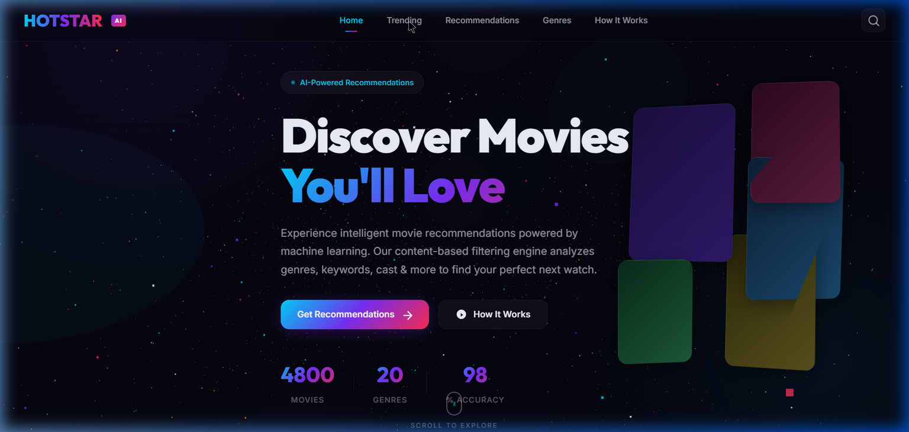
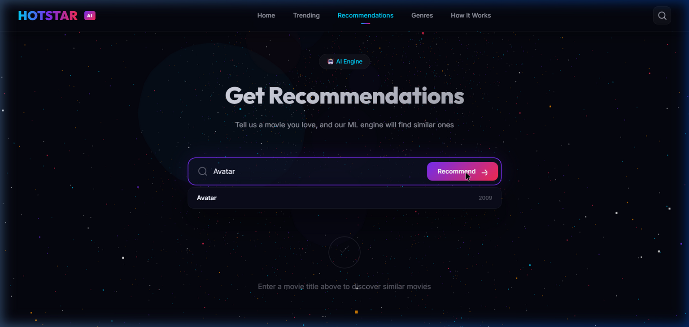
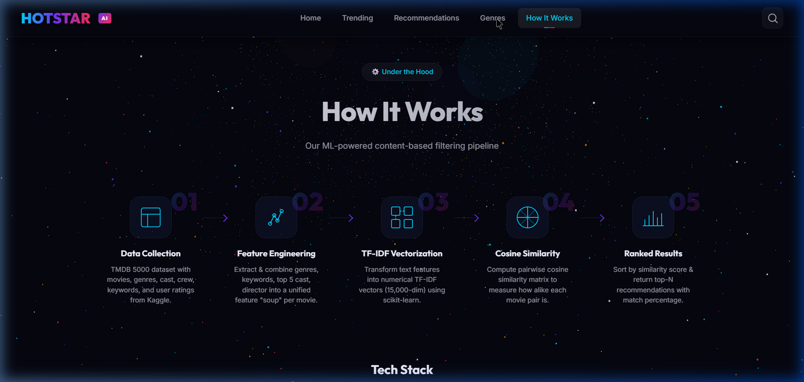
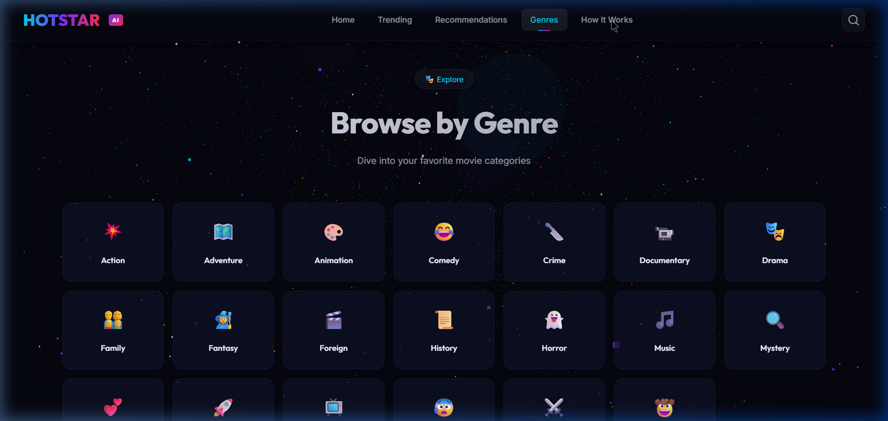
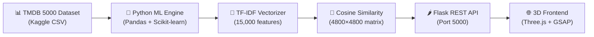

# 🎬 HOTSTAR AI — Movie Recommendation System

## Project Overview
A **data-driven movie recommendation system** for the Hotstar platform featuring a mesmerizing 3D web interface and content-based ML filtering.

---

## Screenshots

````carousel

<!-- slide -->

<!-- slide -->

<!-- slide -->

````

---

## Architecture



---

## Project Structure

| File | Purpose |
|---|---|
| [recommendation_engine.py](file:///c:/Users/Administrator/Desktop/DDR_HOTSTAR/backend/recommendation_engine.py) | Core ML engine — TF-IDF + Cosine Similarity |
| [app.py](file:///c:/Users/Administrator/Desktop/DDR_HOTSTAR/backend/app.py) | Flask REST API server |
| [index.html](file:///c:/Users/Administrator/Desktop/DDR_HOTSTAR/frontend/index.html) | Main HTML with semantic structure |
| [styles.css](file:///c:/Users/Administrator/Desktop/DDR_HOTSTAR/frontend/styles.css) | Premium Hotstar-themed dark design |
| [app.js](file:///c:/Users/Administrator/Desktop/DDR_HOTSTAR/frontend/app.js) | Three.js 3D + GSAP animations + API logic |
| `data/tmdb_5000_movies.csv` | Movie metadata (4803 movies) |
| `data/tmdb_5000_credits.csv` | Cast & crew data |

---

## ML Recommendation Logic

```
1. Data Collection    → TMDB 5000 dataset (movies + credits)
2. Feature Engineering → Extract genres, keywords, top-5 cast, director
3. Feature Soup       → Combine all text features per movie (lowercase)
4. TF-IDF Vectorizer  → Convert text → 15,000-dimensional numerical vectors
5. Cosine Similarity  → Compute pairwise similarity matrix (4800 × 4800)
6. Recommendation     → Sort by similarity score → Return top-N matches
```

## API Endpoints

| Endpoint | Method | Description |
|---|---|---|
| `/api/trending?n=20` | GET | Top movies by popularity |
| `/api/top-rated?n=20` | GET | Highest rated (min 100 votes) |
| `/api/recommend?title=Avatar&n=12` | GET | **ML-powered recommendations** |
| `/api/search?q=inter&n=20` | GET | Search movies by title |
| `/api/genre/Action?n=20` | GET | Movies filtered by genre |
| `/api/genres` | GET | List all genre names |
| `/api/movie/<id>` | GET | Single movie details |

## 3D & Visual Features

- **Three.js Starfield** — 6,000 color-coded particles + nebula clouds with scroll parallax
- **GSAP ScrollTrigger** — Staggered 3D card entrances, section reveals, stat counters
- **3D Card Tilt** — Mouse-tracking perspective transform on hover
- **Glassmorphism** — Frosted glass navbar, badges, and cards
- **Floating Cards** — Animated 3D movie cards in the hero section

## How to Run

```bash
# 1. Start the backend (from project root)
cd backend
python app.py          # Runs on http://localhost:5000

# 2. Serve the frontend (from project root)
cd frontend
python -m http.server 8080   # Open http://localhost:8080
```

> [!TIP]
> The Flask server loads 4,800 movies and builds the TF-IDF matrix on startup (~5 seconds). After that, recommendations are instant.

## Tech Stack

| Layer | Technology |
|---|---|
| ML Engine | Python, Pandas, Scikit-learn (TF-IDF + Cosine Similarity) |
| Backend | Flask, Flask-CORS |
| 3D Graphics | Three.js (WebGL starfield) |
| Animations | GSAP + ScrollTrigger |
| Frontend | Vanilla HTML/CSS/JS |
| Dataset | TMDB 5000 Movies (Kaggle) |
